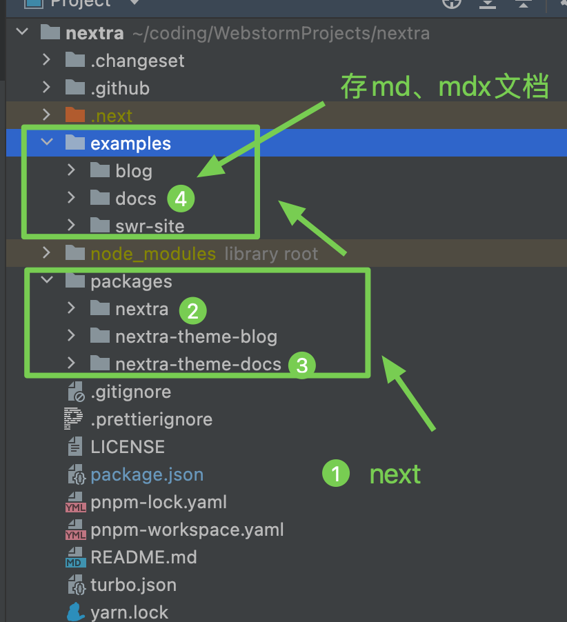
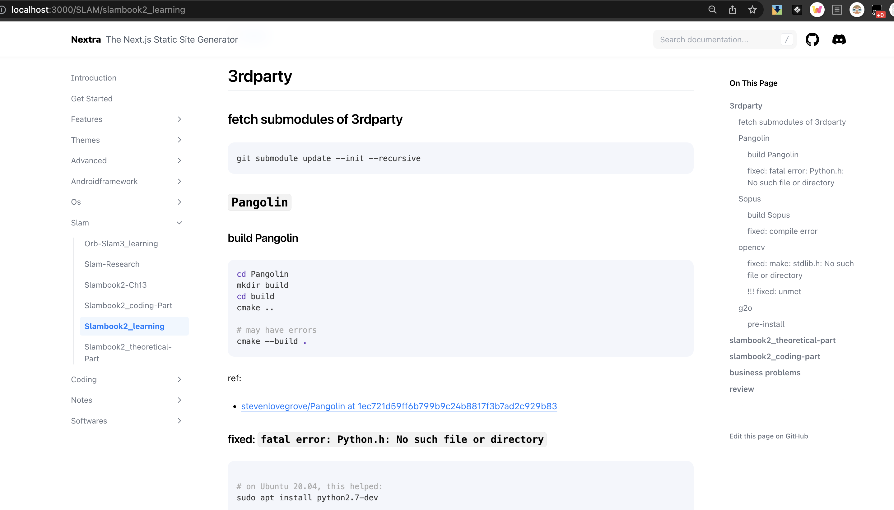

# Nextra

## Intro

（official）Nextra is a `Next.js` plugin that renders your **MDX files** with custom themes.

> 1. next.js 是目前开源静态网站生成器排名第一的项目，基于react
> 2. mdx 是指在md文件中使用react语法，从而能渲染出自定义的组件，于是更灵活

Nextra 允许你以编程的形式将工作区的markdown文件渲染成html，根据考察，拥有以下特性与优点：

1. 底层基于目前最优秀、活跃的nextjs框架
2. 默认已配置了一个开箱即用、ui尚可的模板工程(比hexo的默认效果强非常多，非常适合知识库)
3. 环境配置基本无压力，没有出现意外（gatsby测试的几个demo都有依赖问题，nextjs自己的markdown demo也有点问题）
4. nextra拥有一个core分支，可以自己修改nextra的逻辑，然后再输出，所以在这点上，等价于拥有nextjs的完全开发能力，另外其工程设计、代码质量也很不错这点比我两年前用的vuepress要棒非常多（vuepress也在排名之列）

基于以上，我认为nextra在生命力、易用性、扩展性、审美上，均达到了目标期望，是可以值得长期使用的一款现代化的基于md的博客生成框架。

## architecture

  

## Basic Usage

直接拉取 main 分支，然后将 自己的 markdown 文档放入 `pages` 目录下，然后启动 `yarn && pnpm dev` 即可看到渲染结果，例如：

  

> 1. `yarn` 即 `yarn install` 用于初始化项目
> 2. `pnpm dev` 是使用开发模式加载网站（支持热更新）
> 3. 默认位置为 `http://localhost:3000`

不过这种启动方式，只可以修改一些主题，而不可以修改程序的运行逻辑之类，如果你想自定义整个框架的运行表现，请看 Advanced Usage.

## Advanced Usage

> The Nextra repository uses [PNPM Workspaces](https://pnpm.io/workspaces) and [Turborepo](https://github.com/vercel/turborepo). To install dependencies, just simply run `pnpm` in the project root directory.

切换到 core 分支，可以看到有 `examples` 和 `packages` 两个目录。

其中，`examples` 等价于 main 分支，是用于渲染 md 的上端程序，而 `packages` 则是生成 `examples` 内的应用的依赖程序。

### 开发模式

```sh
# start Nextra Core
cd packages/nextra
yarn
pnpm dev
```

```sh
# start Nextra Theme
cd packages/nextra-theme-docs
yarn
pnpm dev
```

```sh
# start Nextra app
cd examples/docs
pnpm dev
```

Any change to example/docs will be re-rendered instantly.

If you update the core or theme packages, a rebuild is required. Or you can use the watch mode for both nextra and the theme in separated terminals.

### 编译模式

```sh
# start Nextra Core
cd packages/nextra
yarn
pnpm build

# start Nextra Theme
cd -
cd packages/nextra-theme-docs
yarn
pnpm build

cd - 
cd examples/docs
pnpm build
pnpm start
```

## TODO

- [ ] 解决 `No language registration for C++/mermaid`
- [ ] 理解 `pnpm` 和 `yarn` 区别
