---
description:
  Explore projects powered by Nextra, showcasing a diverse range of websites and
  applications built with this powerful Next.js framework, from GraphQL tools to
  JavaScript resources.
---

import { Cards, Image } from 'nextra/components'
import { cloneElement } from 'react'

# Showcase

Projects powered by Nextra

{/* prettier-ignore */}
<Cards>
<>[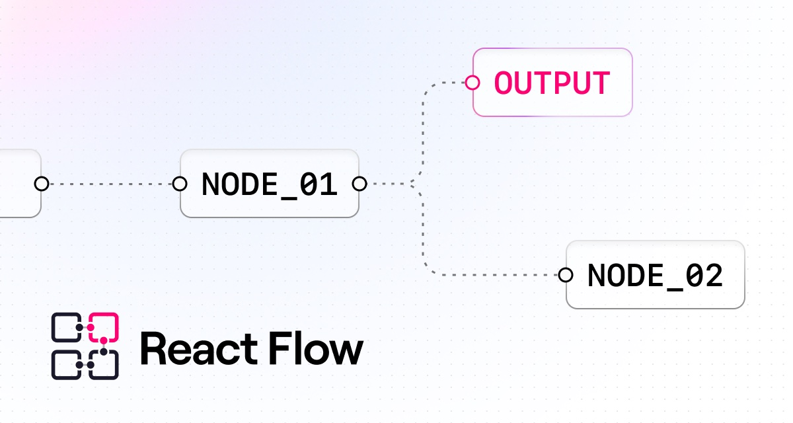](https://reactflow.dev)</>
<></>
<>[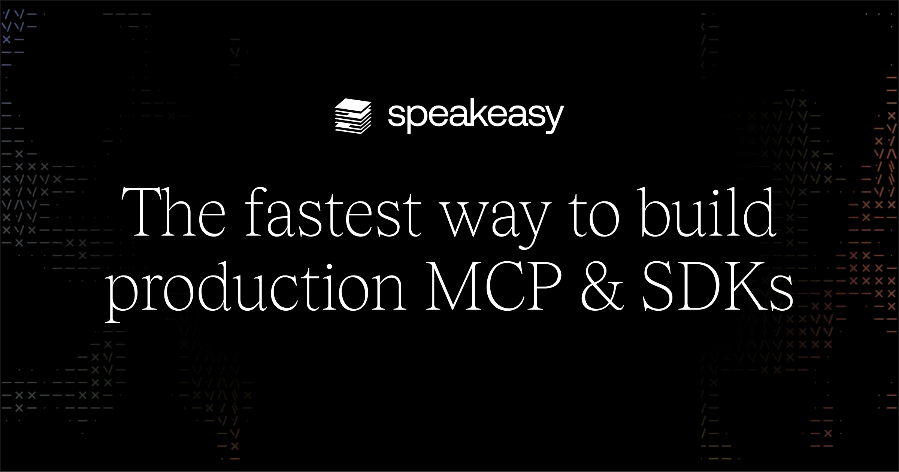](https://speakeasyapi.dev/docs)</>
<></>
<></>
<>[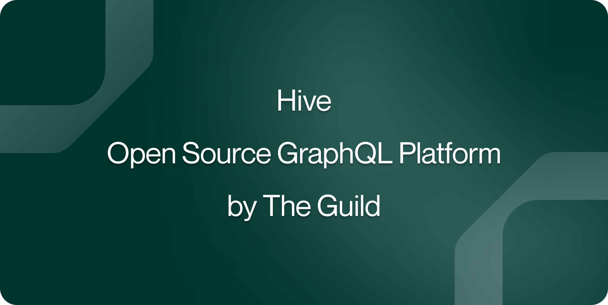](https://the-guild.dev/graphql/hive)</>
<></>
<></>
<></>
<>[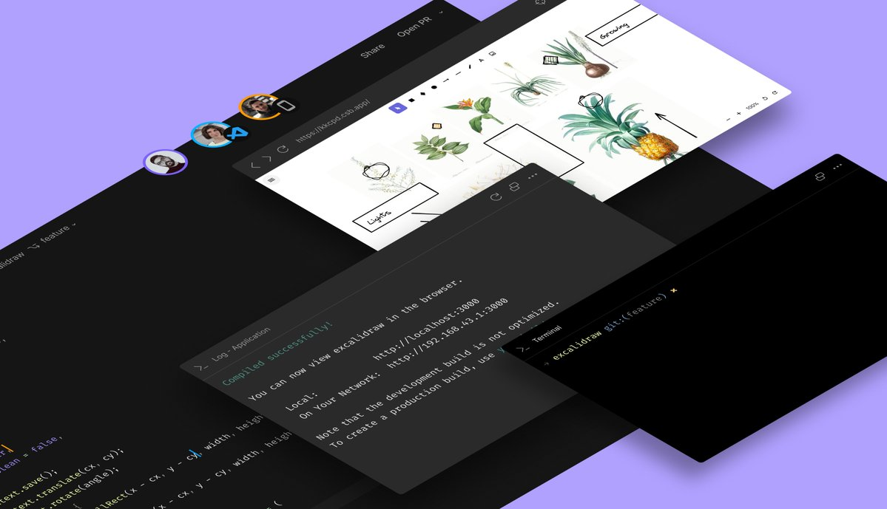](https://codesandbox.io/docs/learn/introduction/overview)</>
<></>
<></>
<></>
<>[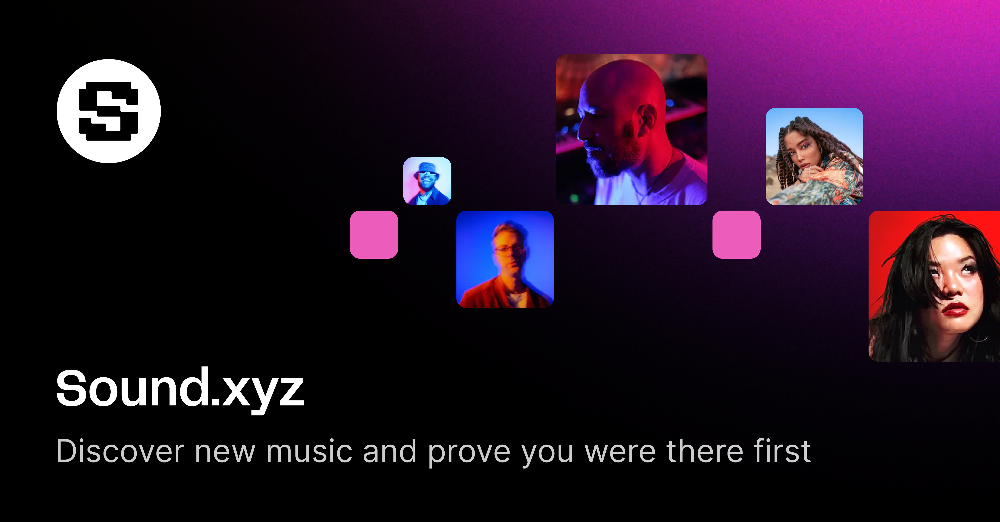](https://docs.sound.xyz)</>
<>[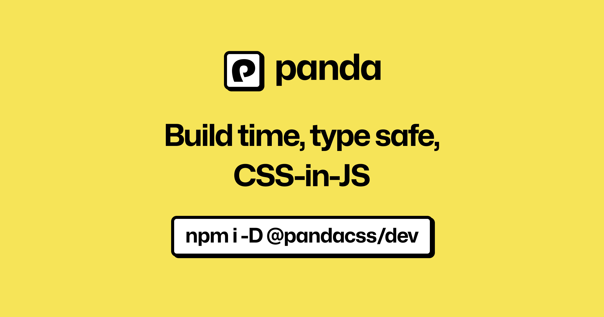](https://panda-css.com)</>
<></>
<></>
<></>
<>[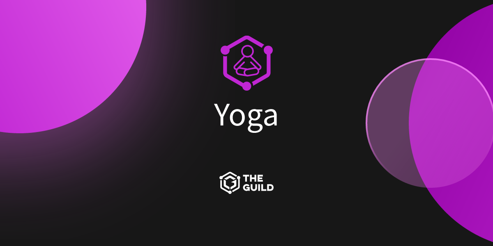](https://the-guild.dev/graphql/yoga-server)</>
<></>
<></>
<>[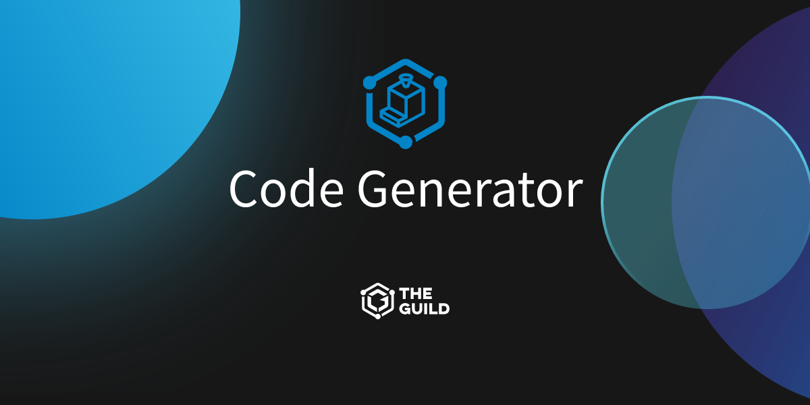](https://the-guild.dev/graphql/codegen)</>
<></>
<>[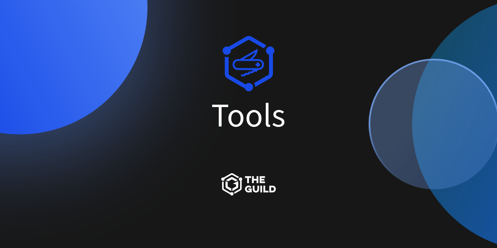](https://the-guild.dev/graphql/tools)</>
<></>
<>[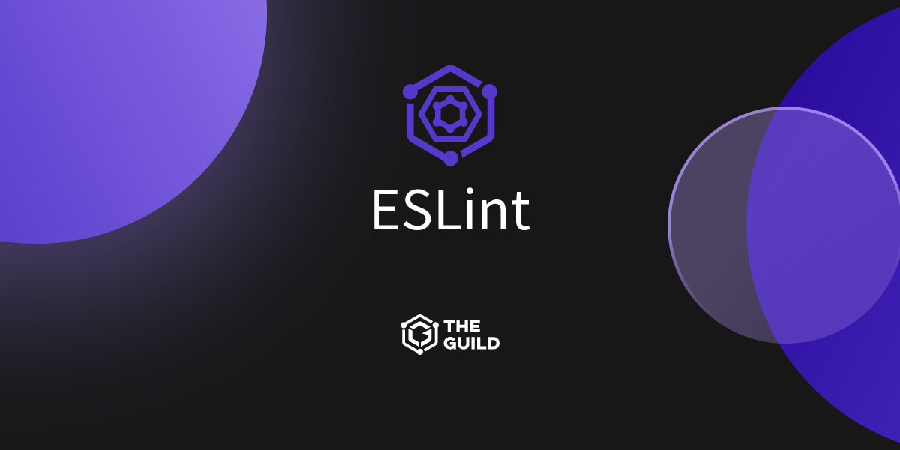](https://the-guild.dev/graphql/eslint)</>
<></>
<></>
<>[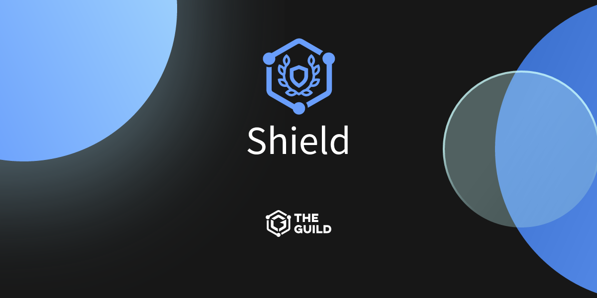](https://the-guild.dev/graphql/shield)</>
<></>
<>[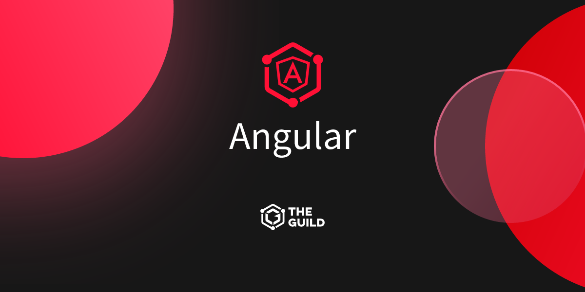](https://the-guild.dev/graphql/apollo-angular)</>
<></>
<></>
<></>
<></>
<></>
<></>
<>[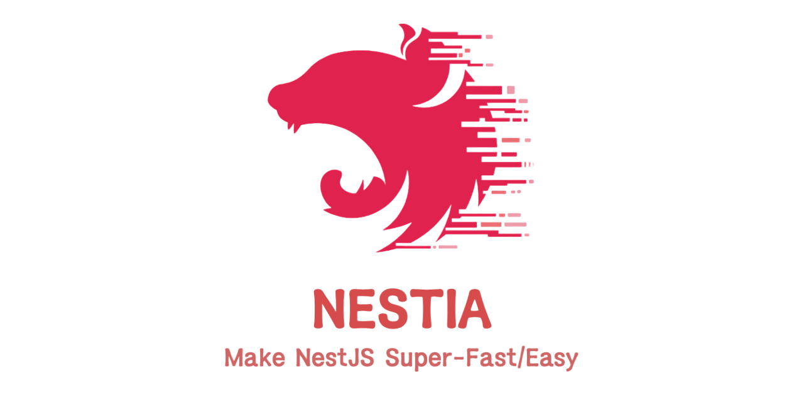](https://nestia.io)</>
<>[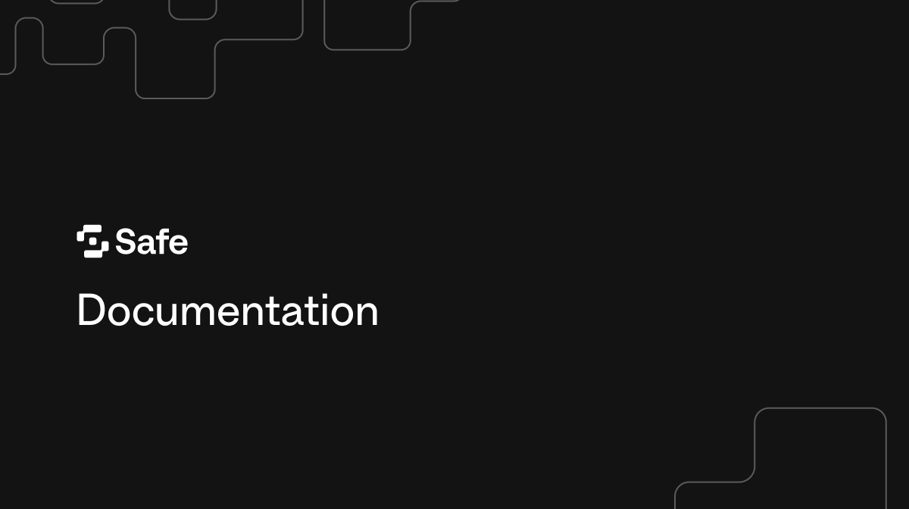](https://docs.safe.global)</>
<>[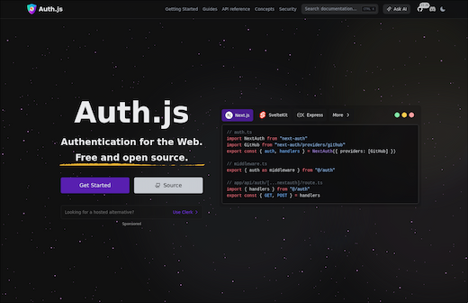](https://authjs.dev)</>
<></>
<></>
<>[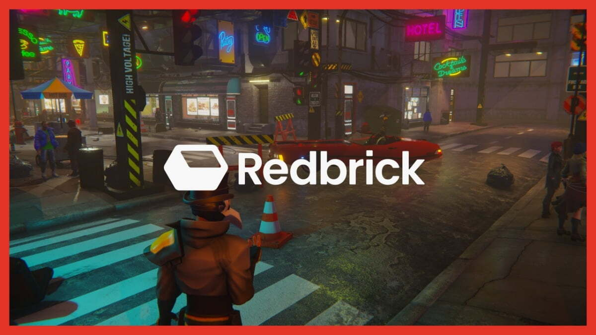](https://wiki.redbrick.land)</>
<>[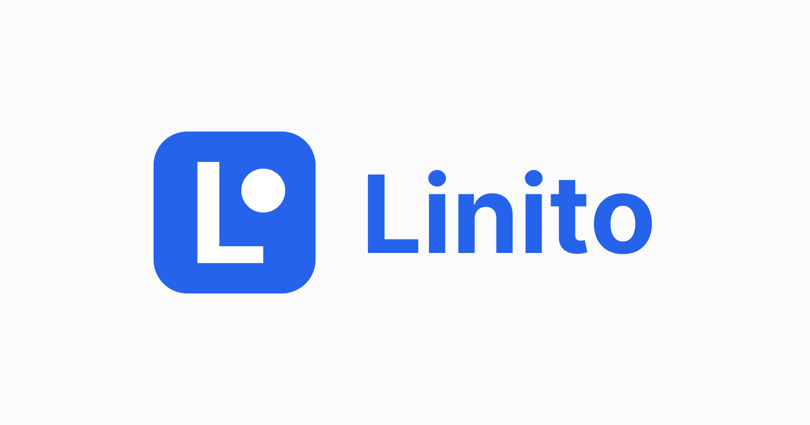](https://www.linito.io/docs)</>
<>[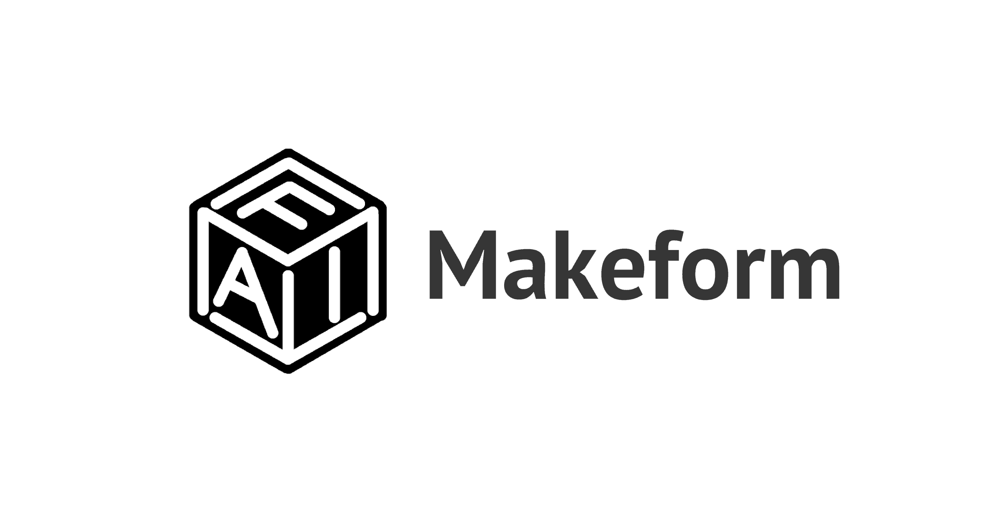](https://www.makeform.ai/help)</>
<>[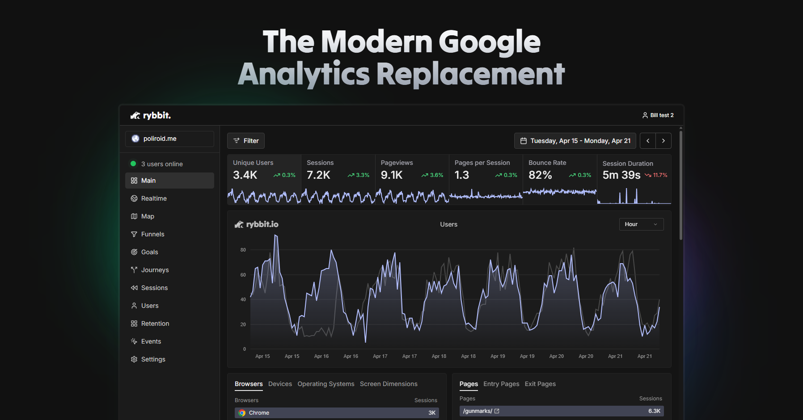](https://rybbit.io)</>
<>[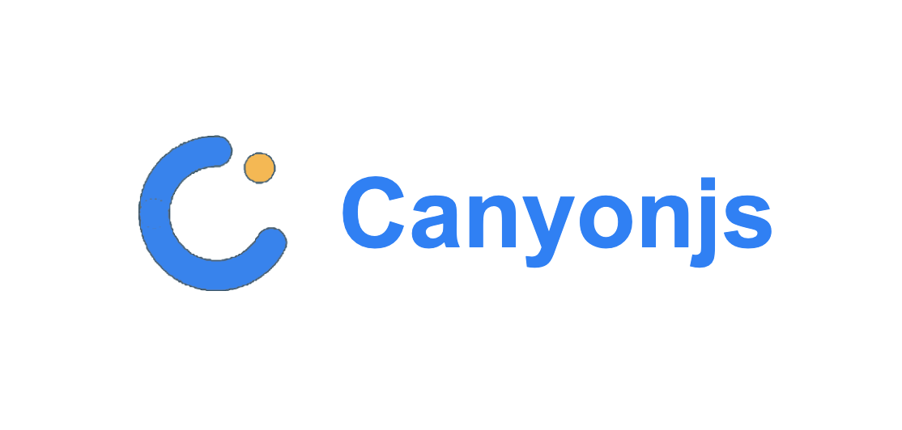](https://docs.canyonjs.org)</>
<>[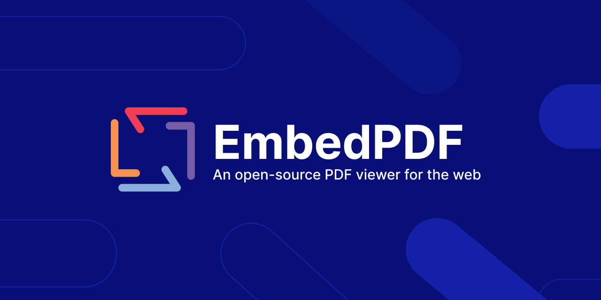](https://www.embedpdf.com)</>
</Cards>

export default function MdxLayout(props) {
  return cloneElement(props.children, {
    components: {
      img: props => (
        <Image {...props} className="object-cover [aspect-ratio:12/6.3]" />
      ),
      a({ children, href }) {
        const { alt } = children.props
        return (
          <Cards.Card
            href={href}
            title={alt.replace(/ preview$/i, '')}
            target="_blank"
            rel="noreferrer"
            arrow
            className="!no-underline"
          >
            {children}
          </Cards.Card>
        )
      },
      p(props) {
        return (
          

        )
      }
    }
  })
}
