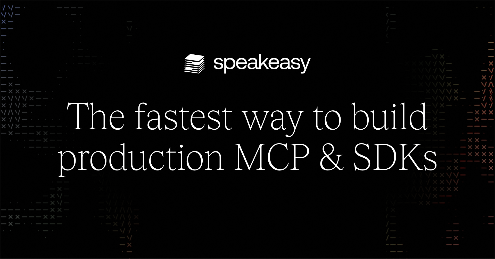

---
description:
  Support Nextra by exploring its sponsors. Learn how they contribute to the
  development and success of the Nextra framework
---

import { Button, Cards, Image } from 'nextra/components'
import { cloneElement } from 'react'

# Sponsors

  <Button
    className="mt-3 inline-block !px-6 hover:!no-underline"
    variant="outline"
    href="https://github.com/sponsors/dimaMachina"
    as="a"
    target="_blank"
    rel="noreferrer"
  >
    {'Become a Sponsor'}
  </Button>

{/* prettier-ignore */}
<Cards num={3}>
<></>
<></>
<></>
</Cards>

export default function MdxLayout(props) {
  return cloneElement(props.children, {
    components: {
      img: props => (
        <Image {...props} className="object-cover [aspect-ratio:12/6.3]" />
      ),
      a({ children, href }) {
        const { alt } = children.props
        return (
          <Cards.Card
            href={href}
            title={alt.replace(/ preview$/i, '')}
            target="_blank"
            rel="noreferrer"
            arrow
            className="!no-underline"
          >
            {children}
          </Cards.Card>
        )
      }
    }
  })
}
