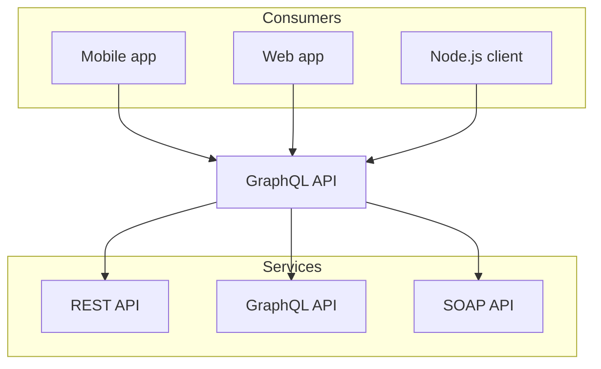

# Mermaid

Nextra supports [mermaid](https://mermaid.js.org) diagrams. Like in GitHub you
can use it in your markdown files by using the `mermaid` code block language.
Out of the box, Nextra uses
[`@theguild/remark-mermaid`](https://npmjs.com/package/@theguild/remark-mermaid)
package that replaces the code block with the `<Mermaid />` component.

## Example



## Usage

````mdx filename="Markdown"

````
