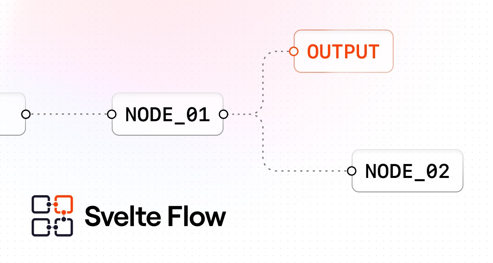
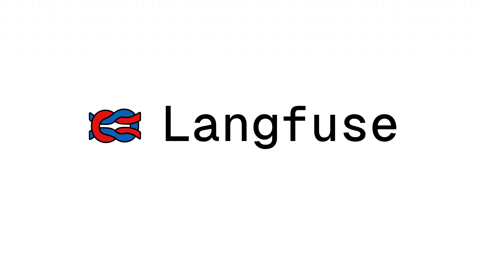
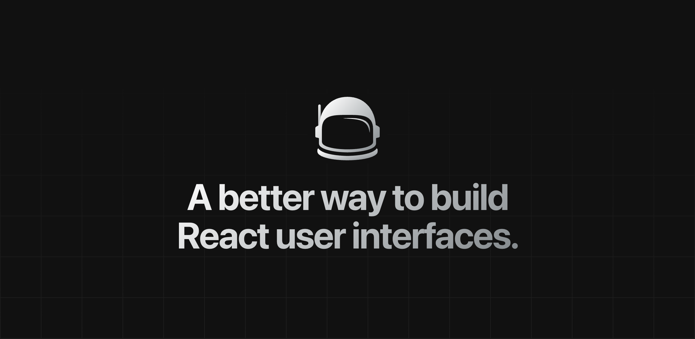
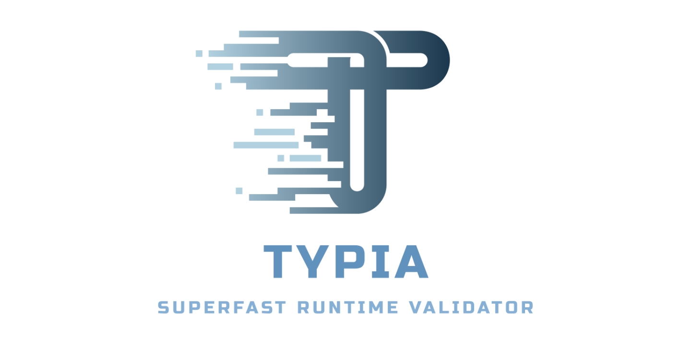
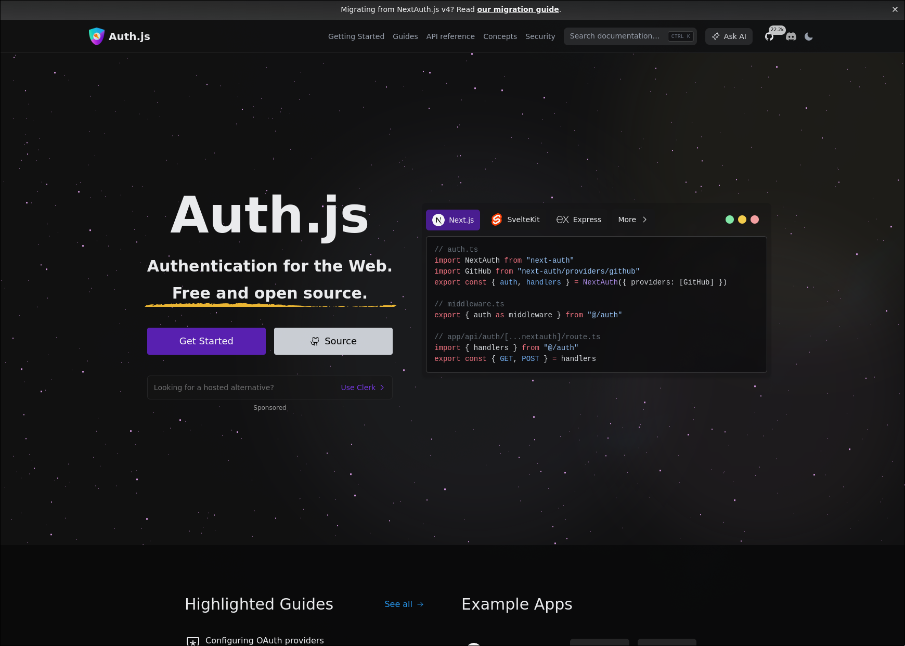

import { Cards } from 'nextra/components'

  # Showcase

  

    {'Open source projects powered by Nextra'}
  

<Cards>
  <Card title="GraphQL Hive" href="https://the-guild.dev/graphql/hive">
    <></>
  </Card>
  <Card title="Speakeasy" href="https://speakeasyapi.dev/docs">
    <></>
  </Card>
  <Card title="React Flow" href="https://reactflow.dev">
    <></>
  </Card>
  <Card title="Svelte Flow" href="https://svelteflow.dev">
    <></>
  </Card>
  <Card title="The Graph" href="https://thegraph.com/docs/en">
    <></>
  </Card>
  <Card title="GraphQL" href="https://graphql.org">
    <></>
  </Card>
  <Card title="SWR" href="https://swr.vercel.app">
    <></>
  </Card>
  <Card title="COBE" href="https://cobe.vercel.app">
    <></>
  </Card>
  <Card
    title="JavaScript Patterns"
    href="https://javascriptpatterns.vercel.app"
  >
    <></>
  </Card>
  <Card
    title="CodeSandbox"
    href="https://codesandbox.io/docs/learn/introduction/overview"
  >
    <></>
  </Card>
  <Card title="DocsGPT" href="https://docs.docsgpt.co.uk">
    <></>
  </Card>
  <Card title="CloudQuery" href="https://cloudquery.io">
    <></>
  </Card>
  <Card title="Edge Runtime" href="https://edge-runtime.vercel.app">
    <></>
  </Card>
  <Card title="Livepeer" href="https://docs.livepeer.org/guides/overview">
    <></>
  </Card>
  <Card title="Sound.xyz" href="https://docs.sound.xyz">
    <></>
  </Card>
  <Card title="Panda" href="https://panda-css.com">
    <></>
  </Card>
  <Card title="Kuma UI" href="https://kuma-ui.com">
    <></>
  </Card>
  <Card title="Langfuse" href="https://langfuse.com">
    <>
      
    </>
  </Card>
  <Card title="The Guild Blog" href="https://the-guild.dev">
    <></>
  </Card>
  <Card title="GraphQL Yoga" href="https://the-guild.dev/graphql/yoga-server">
    <></>
  </Card>
  <Card title="GraphQL Envelop" href="https://the-guild.dev/graphql/envelop">
    <></>
  </Card>
  <Card
    title="GraphQL Inspector"
    href="https://the-guild.dev/graphql/inspector"
  >
    <></>
  </Card>
  <Card
    title="GraphQL Code Generator"
    href="https://the-guild.dev/graphql/codegen"
  >
    <></>
  </Card>
  <Card title="GraphQL Mesh" href="https://the-guild.dev/graphql/mesh">
    <></>
  </Card>
  <Card title="GraphQL Tools" href="https://the-guild.dev/graphql/tools">
    <></>
  </Card>
  <Card title="GraphQL Modules" href="https://the-guild.dev/graphql/modules">
    <></>
  </Card>
  <Card title="GraphQL ESLint" href="https://the-guild.dev/graphql/eslint">
    <></>
  </Card>
  <Card title="GraphQL Config" href="https://the-guild.dev/graphql/config">
    <></>
  </Card>
  <Card title="GraphQL Scalars" href="https://the-guild.dev/graphql/scalars">
    <></>
  </Card>
  <Card title="GraphQL Shield" href="https://the-guild.dev/graphql/shield">
    <></>
  </Card>
  <Card title="GraphQL SOFA" href="https://the-guild.dev/graphql/sofa-api">
    <></>
  </Card>
  <Card
    title="Apollo Angular"
    href="https://the-guild.dev/graphql/apollo-angular"
  >
    <></>
  </Card>
  <Card title="KitQL" href="https://kitql.dev">
    <></>
  </Card>
  <Card title="GraphQL SSE" href="https://the-guild.dev/graphql/sse">
    <></>
  </Card>
  <Card title="GraphQL WS" href="https://the-guild.dev/graphql/ws">
    <></>
  </Card>
  <Card title="feTS" href="https://the-guild.dev/openapi/fets">
    <></>
  </Card>
  <Card
    title="JavaScript Code Challenges"
    href="https://jscodechallenges.vercel.app"
  >
    <></>
  </Card>
  <Card title="React Cosmos" href="https://reactcosmos.org">
    <></>
  </Card>
  <Card title="Typia" href="https://typia.io">
    <></>
  </Card>
  <Card title="Nestia" href="https://nestia.io">
    <></>
  </Card>
  <Card title="Safe" href="https://docs.safe.global">
    <></>
  </Card>
  <Card title="Auth.js" href="https://authjs.dev">
    <></>
  </Card>
  <Card title="imgix" href="https://docs.imgix.com">
    <></>
  </Card>
  <Card title="AnythingLLM" href="https://anythingllm.com/">
    <></>
  </Card>
</Cards>

export const Card = Object.assign(
  // Copy card component and add default props
  Cards.Card.bind(),
  {
    displayName: 'Card',
    defaultProps: {
      arrow: true,
      target: '_blank',
      rel: 'noreferrer'
    }
  }
)

