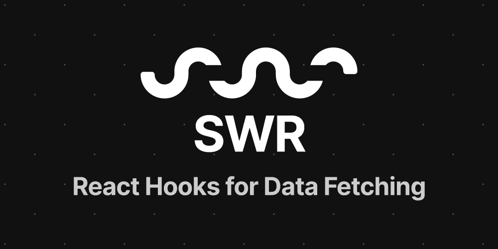
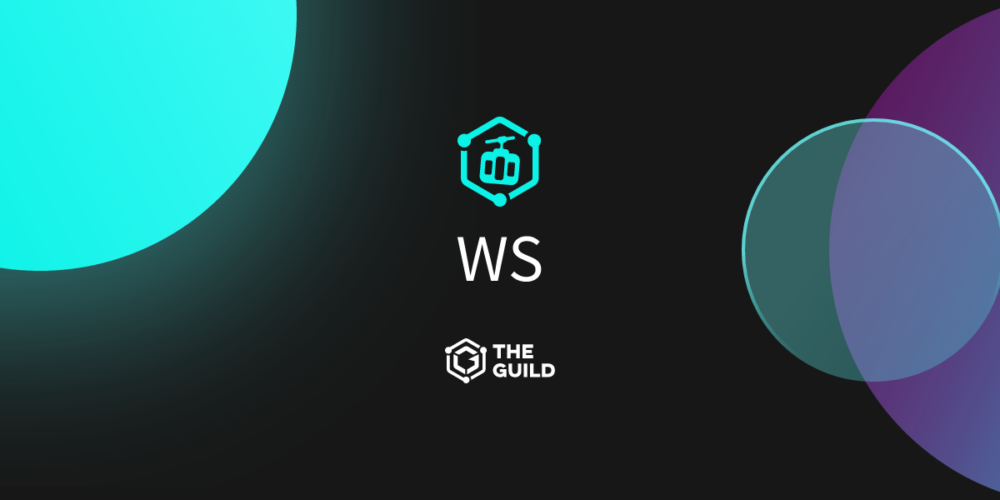
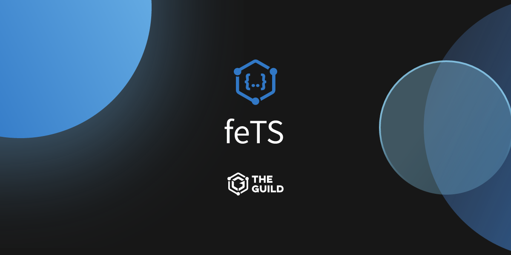

import { Card, Cards } from 'nextra/components'

{<h1 className="mt-10 mb-4 text-center text-[2.5rem] font-bold tracking-tight">Showcase</h1>}

{
Open
source projects powered by Nextra
}

<Cards>
  <ShowcaseCard title="Node.js" href="https://nodejs.org/en">
    <></>
  </ShowcaseCard>
  <ShowcaseCard title="The Graph" href="https://thegraph.com/docs/en">
    <></>
  </ShowcaseCard>
  <ShowcaseCard title="Turbo" href="https://turbo.build">
    <></>
  </ShowcaseCard>
  <ShowcaseCard title="SWR" href="https://swr.vercel.app">
    <></>
  </ShowcaseCard>
  <ShowcaseCard title="COBE" href="https://cobe.vercel.app">
    <></>
  </ShowcaseCard>
  <ShowcaseCard
    title="JavaScript Patterns"
    href="https://javascriptpatterns.vercel.app"
  >
    <></>
  </ShowcaseCard>
  <ShowcaseCard
    title="CodeSandbox"
    href="https://codesandbox.io/docs/learn/introduction/overview"
  >
    <></>
  </ShowcaseCard>
  <ShowcaseCard title="CloudQuery" href="https://cloudquery.io">
    <></>
  </ShowcaseCard>
  <ShowcaseCard title="Edge Runtime" href="https://edge-runtime.vercel.app">
    <></>
  </ShowcaseCard>
  <ShowcaseCard
    title="Livepeer"
    href="https://docs.livepeer.org/guides/overview"
  >
    <></>
  </ShowcaseCard>
  <ShowcaseCard title="Sound.xyz" href="https://docs.sound.xyz">
    <></>
  </ShowcaseCard>
  <ShowcaseCard title="Million" href="https://million.dev">
    <></>
  </ShowcaseCard>
  <ShowcaseCard title="Panda" href="https://panda-css.com">
    <></>
  </ShowcaseCard>
  <ShowcaseCard title="The Guild Blog" href="https://the-guild.dev">
    <></>
  </ShowcaseCard>
  <ShowcaseCard title="GraphQL Hive" href="https://the-guild.dev/graphql/hive">
    <></>
  </ShowcaseCard>
  <ShowcaseCard
    title="GraphQL Yoga"
    href="https://the-guild.dev/graphql/yoga-server"
  >
    <></>
  </ShowcaseCard>
  <ShowcaseCard
    title="GraphQL Envelop"
    href="https://the-guild.dev/graphql/envelop"
  >
    <></>
  </ShowcaseCard>
  <ShowcaseCard
    title="GraphQL Inspector"
    href="https://the-guild.dev/graphql/inspector"
  >
    <></>
  </ShowcaseCard>
  <ShowcaseCard
    title="GraphQL Code Generator"
    href="https://the-guild.dev/graphql/codegen"
  >
    <></>
  </ShowcaseCard>
  <ShowcaseCard title="GraphQL Mesh" href="https://the-guild.dev/graphql/mesh">
    <></>
  </ShowcaseCard>
  <ShowcaseCard
    title="GraphQL Tools"
    href="https://the-guild.dev/graphql/tools"
  >
    <></>
  </ShowcaseCard>
  <ShowcaseCard
    title="GraphQL Modules"
    href="https://the-guild.dev/graphql/modules"
  >
    <></>
  </ShowcaseCard>
  <ShowcaseCard
    title="GraphQL ESLint"
    href="https://the-guild.dev/graphql/eslint"
  >
    <></>
  </ShowcaseCard>
  <ShowcaseCard
    title="GraphQL Config"
    href="https://the-guild.dev/graphql/config"
  >
    <></>
  </ShowcaseCard>
  <ShowcaseCard
    title="GraphQL Scalars"
    href="https://the-guild.dev/graphql/scalars"
  >
    <></>
  </ShowcaseCard>
  <ShowcaseCard
    title="GraphQL Shield"
    href="https://the-guild.dev/graphql/shield"
  >
    <></>
  </ShowcaseCard>
  <ShowcaseCard
    title="GraphQL SOFA"
    href="https://the-guild.dev/graphql/sofa-api"
  >
    <></>
  </ShowcaseCard>
  <ShowcaseCard
    title="Apollo Angular"
    href="https://the-guild.dev/graphql/apollo-angular"
  >
    <></>
  </ShowcaseCard>
  <ShowcaseCard title="KitQL" href="https://kitql.dev">
    <></>
  </ShowcaseCard>
  <ShowcaseCard title="GraphQL SSE" href="https://the-guild.dev/graphql/sse">
    <></>
  </ShowcaseCard>
  <ShowcaseCard title="GraphQL WS" href="https://the-guild.dev/graphql/ws">
    <></>
  </ShowcaseCard>
  <ShowcaseCard title="feTS" href="https://the-guild.dev/openapi/fets">
    <></>
  </ShowcaseCard>
</Cards>

export const ShowcaseCard = Object.assign(
  // Copy card component and add default props
  Card.bind(),
  {
    displayName: 'ShowcaseCard',
    defaultProps: {
      image: true,
      arrow: true,
      target: '_blank'
    }
  }
)

