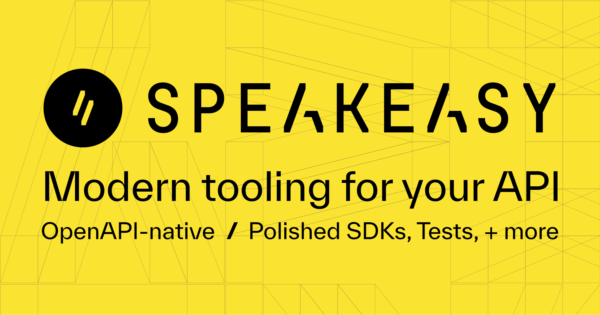

import { Button, Cards } from 'nextra/components'
import { Card } from './showcase.mdx'

  # Sponsors
   
  <Button
    className="!px-6 hover:!no-underline"
    variant="outline"
    href="https://github.com/sponsors/dimaMachina"
    as="a"
    target="_blank"
    rel="noreferrer"
  >
    {'Become a Sponsor'}
  </Button>

<Cards num={3}>
  <Card
    title="GraphQL Hive"
    href="https://the-guild.dev/graphql/hive?utm_source=nextra.site&utm_campaign=nextra&utm_content=logolink"
  >
    <></>
  </Card>
  <Card
    title="Speakeasy"
    href="https://speakeasyapi.dev/docs?utm_source=nextra.site&utm_campaign=nextra&utm_content=logolink"
  >
    <></>
  </Card>
</Cards>

